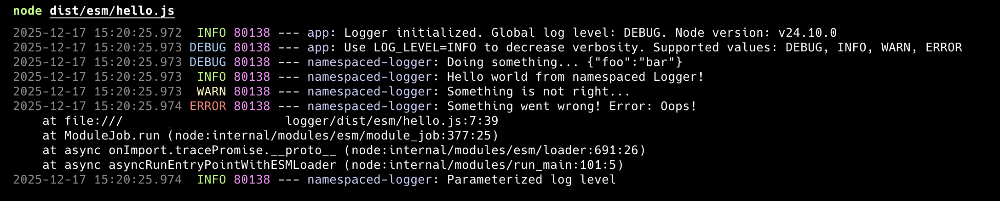

# Minimalist Logger

A minimalist logger for Node.js. Log output format is something like Java Log4j format.

This is a `stdout / stderr` only logger. If you need more of this, then check out other loggers.

Supports both ESM and CommonJS module systems.

# Environment variables

- `LOG_LEVEL` - Log level. Default: `DEBUG`. Possible values: `DEBUG`, `INFO`, `WARN`, `ERROR`.
- `ROOT_LOGGER_NAME` - Root logger name. Default: `app`.

# Usage

```ts
import logger from '@janez89/logger';

logger.info('Hello world from App Logger!');
```

__Output__:

```
2025-12-17 13:19:19.546  INFO 74822 --- app: Logger initialized. Global log level: DEBUG. Node version: v22.15.0
2025-12-17 13:19:19.546 DEBUG 74822 --- app: Use LOG_LEVEL=INFO to decrease verbosity. Supported values: DEBUG, INFO, WARN, ERROR
2025-12-17 13:19:19.546  INFO 74822 --- app: Hello world from App Logger!
```

```ts
import { getLogger } from '@janez89/logger';

const logger = getLogger('namespaced-logger');

logger.debug('Doing something...', { foo: 'bar' });
logger.info('Hello world from namespaced Logger!');
logger.warn('Something is not right...');
logger.error('Something went wrong!', new Error('Oops!'));
logger.log('INFO', 'Parameterized log level');
```

__Output__:

```
2025-12-17 15:17:39.775  INFO 79680 --- app: Logger initialized. Global log level: DEBUG. Node version: v22.15.0
2025-12-17 15:17:39.776 DEBUG 79680 --- app: Use LOG_LEVEL=INFO to decrease verbosity. Supported values: DEBUG, INFO, WARN, ERROR
2025-12-17 15:17:39.776 DEBUG 79680 --- namespaced-logger: Doing something... {"foo":"bar"}
2025-12-17 15:17:39.776  INFO 79680 --- namespaced-logger: Hello world from namespaced Logger!
2025-12-17 15:17:39.776  WARN 79680 --- namespaced-logger: Something is not right...
2025-12-17 15:17:39.776 ERROR 79680 --- namespaced-logger: Something went wrong! Error: Oops!
    at <anonymous> (.../logger/src/hello.ts:10:39)
    at ModuleJob.run (node:internal/modules/esm/module_job:274:25)
    at async onImport.tracePromise.__proto__ (node:internal/modules/esm/loader:644:26)
    at async asyncRunEntryPointWithESMLoader (node:internal/modules/run_main:116:5)
2025-12-17 15:17:39.776  INFO 79680 --- namespaced-logger: Parameterized log level
```



# API

```ts
type LogLevel = 'DEBUG' | 'INFO' | 'WARN' | 'ERROR';

interface Logger {
    debug: (...args: unknown[]) => void;
    info: (...args: unknown[]) => void;
    warn: (...args: unknown[]) => void;
    error: (...args: unknown[]) => void;
    log: (level: LogLevel, ...args: unknown[]) => void;
    level: LogLevel;
    name: string;
}

declare const logger: Logger;

/**
 * Get a logger instance with the specified name.
 * @param name Name of the logger.
 * @param logLevel Log level for the logger. Defaults to the global log level.
 */
export declare function getLogger(name: string, logLevel?: LogLevel): Logger;
export default logger;
```

# History

- 1.0.0 Initial release
